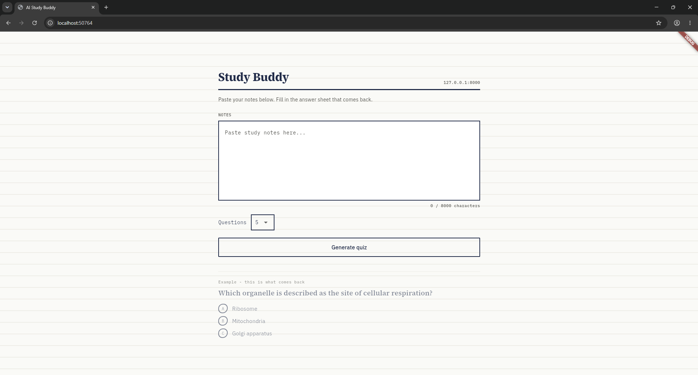
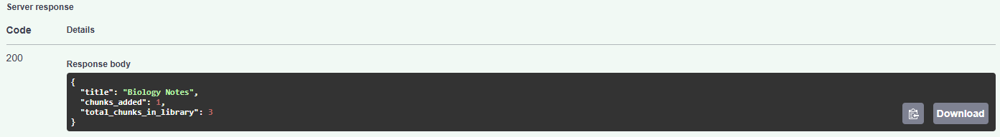
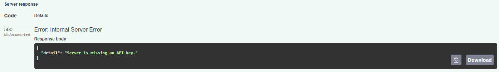

# AI Study Buddy

Paste study notes, get a multiple-choice quiz generated from them, and test
yourself. A Flutter app talking to a Python backend that calls the Claude API.

Live backend: [ai-study-buddy-lazv.onrender.com](https://ai-study-buddy-lazv.onrender.com)
(hosted on Render's free tier - the first request after a period of
inactivity can take 30-50 seconds to wake up)

The root URL itself returns a 404 - that's expected, there's nothing
defined there. To actually see it working, try:

- [/health](https://ai-study-buddy-lazv.onrender.com/health) - confirms the server is running
- [/docs](https://ai-study-buddy-lazv.onrender.com/docs) - interactive API docs where you can try every endpoint directly in the browser

## Screenshots

**Flutter app - home screen**



**Backend API - adding a note to the library**



**RAG retrieval - correctly finds relevant notes before calling the AI**



---

## Why I built this

Making practice questions from your own notes takes time. This automates
that step so studying starts faster.

## Architecture

```
Flutter app  --HTTP-->  FastAPI backend  --API call-->  Claude
```

The Flutter app never talks to Claude directly. It only calls the backend,
which holds the API key and does the actual generation. This keeps the key
off the client and makes it possible to add features later (auth, rate
limiting, saving quiz history) without touching the app.

## Project structure

```
ai-study-buddy/
    backend/
        main.py           FastAPI app: quiz generation, notes library endpoints
        rag.py            chunking and BM25 retrieval for the notes library
        database.py       SQLite persistence for the notes library
        requirements.txt
    frontend/
        lib/
            main.dart          app entry point, notes input screen
            quiz_screen.dart   quiz taking screen with scoring
            study_buddy_api.dart   HTTP client for the backend
            quiz_question.dart     data model
        pubspec.yaml
    frontend-web/
        index.html        standalone browser test page, no build step
    flutter-home.png
    backend-api.png
    rag-search.png
```

## Running the backend

```bash
cd backend
pip install -r requirements.txt
export ANTHROPIC_API_KEY=sk-ant-your-key-here
uvicorn main:app --reload
```

Runs at `http://127.0.0.1:8000`. Check it works:

```bash
curl http://127.0.0.1:8000/health
```

## Running the Flutter app

```bash
cd frontend
flutter pub get
flutter run -d chrome --dart-define=BACKEND_URL=http://127.0.0.1:8000
```

The `BACKEND_URL` define points the app at your running backend. Without
it, the app defaults to `http://127.0.0.1:8000`.

## Trying the browser test page (no Flutter needed)

`frontend-web/index.html` is a standalone page that talks to the same
backend, useful for testing or demoing without installing Flutter. It has
no dependencies and no build step.

1. Start the backend as described above, and leave it running.
2. Open `frontend-web/index.html` directly in a browser (double-click it,
   or drag it into a browser window).
3. Paste some notes and generate a quiz.

It expects the backend at `http://127.0.0.1:8000`. If you deploy the
backend elsewhere, change the `BACKEND_URL` constant near the top of the
`<script>` section in that file.

## Building a quiz from a topic (RAG)

Besides pasting notes directly, you can build up a library of notes over
time and generate a quiz on a specific topic, without needing to paste
everything into one request.

Add a document to the library:

```bash
curl -X POST http://127.0.0.1:8000/notes \
  -H "Content-Type: application/json" \
  -d '{"title": "Biology Chapter 1", "text": "Photosynthesis is..."}'
```

Add as many documents as you like this way. Then generate a quiz on a
topic instead of pasting notes:

```bash
curl -X POST http://127.0.0.1:8000/generate-quiz-from-topic \
  -H "Content-Type: application/json" \
  -d '{"topic": "mitochondria", "num_questions": 5, "difficulty": "medium"}'
```

`difficulty` is optional (`easy`, `medium`, or `hard`; defaults to
`medium`) and changes how the questions are written - `easy` sticks to
facts stated directly in the notes, `hard` requires connecting multiple
ideas rather than just recalling one.

The backend searches the library for the most relevant chunks using BM25
keyword search, sends only those chunks to Claude, and returns a quiz -
the same pattern used in the "RAG and Agentic Search" section of the
"Building with the Claude API" course. The library is stored in a local
SQLite file (`notes.db`, created automatically next to `main.py`), so it
survives server restarts.

## Tracking accuracy over time (SQL window functions)

Every completed quiz is logged with its score. `GET /quiz-history/stats`
returns a running average accuracy per topic, computed directly in SQL
using a window function:

```sql
SELECT source, created_at, score, total,
    AVG(CAST(score AS FLOAT) / total) OVER (
        PARTITION BY source
        ORDER BY created_at
        ROWS BETWEEN UNBOUNDED PRECEDING AND CURRENT ROW
    ) AS running_avg_accuracy
FROM quiz_history
WHERE score IS NOT NULL
```

`PARTITION BY source` keeps each topic's average separate from the
others, and `ORDER BY created_at` makes the average "running" - each row
shows the average up to and including that point in time, not the
overall average. This is the same window function pattern covered in
Kaggle's "Advanced SQL" course.

## Deploying the backend

1. Push this repo to GitHub.
2. Create a free account at render.com.
3. New Web Service, connect this repo, set the root directory to `backend`.
4. Build command: `pip install -r requirements.txt`. Start command: `uvicorn main:app --host 0.0.0.0 --port $PORT`.
5. Add an environment variable: `ANTHROPIC_API_KEY` with your real key.
6. Deploy. You get a public URL, something like `https://ai-study-buddy.onrender.com`.
7. Run the Flutter app with that URL: `flutter run -d chrome --dart-define=BACKEND_URL=https://ai-study-buddy.onrender.com`

## Testing status

Backend: fully tested by running the server and sending real requests.
Confirmed working: input validation (empty notes rejected, question count
capped at 10), missing API key handled cleanly, invalid API key handled
cleanly with no crash. The notes library and topic-based retrieval
(`/notes`, `/generate-quiz-from-topic`) were tested on two separate
machines. During that testing, a real bug was found and fixed: BM25
scoring returns negative/zero scores for terms that appear in a very
small library (a known edge case with tiny corpora), which caused valid
matches to be filtered out. The fix falls back to keyword-overlap
matching when no positive BM25 scores are found. After the fix: adding
documents, listing them, searching with a matching topic (correctly
reaches the AI call and stops cleanly without a key), and searching with
an unrelated topic (correctly returns a 404) all work as expected. The
success path (a valid key producing a real quiz, from either endpoint)
was not run, since that requires a real key - confirm that once yourself.

Persistence was also verified directly: added a note, killed the server
process completely (not just `--reload`, an actual process kill), started
a fresh process, and confirmed the note was still there and searchable.
The library now survives restarts via a local SQLite file (`notes.db`).

Frontend: `flutter analyze` reports no issues. The app was run in Chrome
and confirmed to render correctly, including error handling when the
backend is unreachable, and the difficulty selector renders alongside
the question count selector as expected.

## Running the automated tests

The backend has a pytest suite covering the behavior described above,
so it can be re-checked with one command instead of manual curl requests:

```bash
cd backend
pip install -r requirements.txt
pytest tests/ -v
```

Each test runs against a temporary, isolated SQLite database (not the
real `notes.db`), so running the tests never affects real data. All 13
tests pass: input validation, missing/invalid API key handling, adding
and listing notes, topic search matching and not matching, quiz score
submission (including the not-found case), quiz history retrieval, and
the accuracy trend window-function query (verified against hand-computed
expected values).

## Possible extensions

- Support uploading a PDF or image of notes instead of pasting text
- Flashcard mode in addition to quiz mode
- Show past quiz results (score trends over time) in the app itself,
  using the quiz history data that's already collected

## Tech stack

Flutter, Dart, Python, FastAPI, Anthropic SDK, pytest, SQLite
